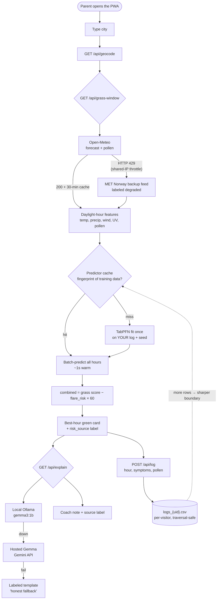

# FieldDay 🌿 — the allergy-smart grass window

One screen tells allergy families the single best hour to go outside today,
then gets out of the way. Built for Hacktoberfest **Week 1: Touch Grass**.

**Live demo:** https://fieldday-r66v.onrender.com ·
**DEV post:** https://dev.to/memeshe/fieldday-the-allergy-smart-grass-window-30jn ·
**Stack:** FastAPI + vanilla JS PWA · **Cost to run:** $0


## The problem

Parents of sneezy kids check three apps (weather, AQI, pollen) and guess.
Guess wrong and the evening is miserable. The data to answer
*"when should we go out?"* exists — it's just never fused into one number,
and never personalized: a county pollen index doesn't know *your* kid flares
at pollen 3 + wind 15 kph but is fine at pollen 4 on still days.

## What it does

1. **Type your city.** Free keyless geocoding + forecast + pollen, no account.
2. **Get one answer.** Every remaining daylight hour scores 0–100
   (temperature curve peaking near 21 °C, rain, wind, UV, storm codes),
   minus *your personal* flare risk × 60. Big green card = go outside now.
3. **Hear why, in parent language.** A Gemma coach note explains the pick
   ("Thursday 9am scores 82 — mild, calm, and your risk is only 0.1").
   The UI always names which model wrote the note — no silent fallbacks.
4. **Log symptoms in 3 taps.** Hour + symptoms + pollen → your log grows,
   your forecast sharpens. Streak counter rewards real outings.
5. **Screen off.** That's the point.

## How it works



Two latency war stories are visible in that diagram:

- **Batch inference.** v1 called TabPFN once per daylight hour — 7 s × 24,
  guaranteed Render timeout. Now: one fit, one batch predict
  (~15 s cold → **~1.3 s warm** via the fingerprint-keyed cache).
- **Upstream resilience.** Open-Meteo 429-throttles Render's shared IP, which
  once blanked the whole demo. Now: retry + UA + 30-min upstream cache so
  repeat visits cost zero weather calls, and a MET Norway backup feed that
  the UI honestly labels when active.

## Prize categories

| Category | Claim | Proof |
|---|---|---|
| **Best Use of TabPFN** | Personal flare risk from *your* symptom log via the tabular foundation model | Every hour labeled `tabpfn` + row count in the UI; `flare_risks()` in `tabpfn_predict.py`; lightweight `tabpfn-client` so Render free tier never OOMs |
| **Best Use of Gemma** | Open-weight coach notes, local-first with hosted fallback | Chain local Ollama → hosted Gemma → labeled template; source shown on every note; never a silent fallback |
| **Best Use of Render** | Full product on the free tier | `render.yaml` one-click deploy; secrets `sync: false`; survives cold starts, throttles, and ephemeral disk (per-user logs degrade gracefully) |
| **Overall** | Theme fit + execution: real inference, real PWA, honest copy | Live URL, smoke CI, field test in the DEV post |

## API reference

| Endpoint | What |
|---|---|
| `GET /api/geocode?name=Hanoi` | City → lat/lon candidates (cached 24 h) |
| `GET /api/grass-window?lat=..&lon=..&uid=..` | Scored daylight hours + `best` + `risk_rows` + `inference_s` + `wx_source` |
| `POST /api/log` `{uid, hour, symptoms, pollen}` | Append one symptom row to that visitor's log |
| `GET /api/explain?...` | Gemma coach note + `source` label |
| `GET /health` | `{"ok": true}` |

Every AI output carries its provenance: `risk_source` (`tabpfn` /
`heuristic`), `wx_source` (`open-meteo` / `metno`), coach `source`
(`gemma-local` / `gemma-hosted-gemini` / `template`).

## Privacy, stated exactly

- Symptom rows sent to Prior Labs' TabPFN inference API are
  **anonymized** (hour, temp, pollen, wind, flare yes/no) and **never used
  for training**; no account, no tracking.
- Per-visitor logs live on the server keyed by a random browser ID —
  judges clicking around never pollute each other.
- Nothing here is medical advice. The footer says so on every screen.

## Run locally

```
pip install -r requirements.txt
export TABPFN_TOKEN="<key>"   # free at https://ux.priorlabs.ai/account
uvicorn app:app --port 8000
# optional: ollama pull gemma3:1b && ollama serve   # local coach notes
# optional: export GEMINI_API_KEY=...               # hosted Gemma notes
# optional: export HF_TOKEN=... / GROQ_API_KEY=...  # alternate hosted notes
```

Tests: `python -m pytest tests/ -q` (6 smoke tests, also run by CI).
Deploy: `render.yaml` — set the same env keys in the Render dashboard.

## Project layout

```
app.py               FastAPI: scoring, upstream feeds, cache, Gemma chain
tabpfn_predict.py    TabPFN fit/predict, predictor cache, per-user log paths
static/index.html    the whole UI (one screen, mobile-first)
static/manifest.json static/sw.js static/icon.svg   real PWA shell
data/symptoms_sample.csv   48 clearly-synthetic seed rows (~1/3 flares)
tests/test_smoke.py  6 smoke tests   .github/workflows/smoke.yml  CI
DEV_POST_DRAFT.md    entry post draft   DEV_POST_FINAL.md  publishable version
```

## What's next

Voice "go now" nudge · household profiles · fully-offline forecast cache ·
outdoor photo verification (landing in the DEV post this week).

## Credits

- TabPFN via [Prior Labs](https://www.priorlabs.ai), Gemma open weights via
  Google, weather via Open-Meteo + MET Norway.
- Post images: Rick Obst & Peter Salanki, CC BY 2.0, via Wikimedia Commons.
